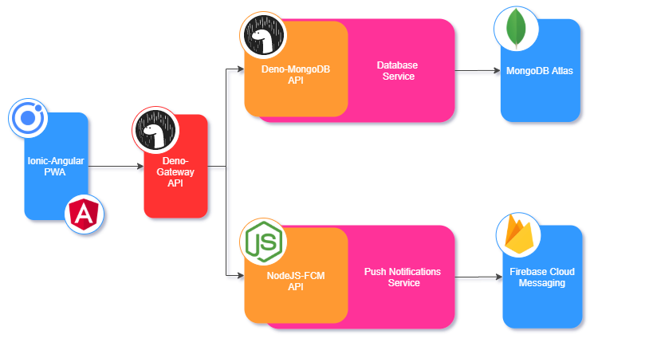

 |  |  
---------|---------|---------

# INSTITUTO TECNOLÓGICO DE TIJUANA 

 ## :blue_book: Datos de la materia
 * **Materia:** Análisis Avanzado de Desarrollo de Software
 * **Clave:** ADF-1702 IF8A
 * **Horario** Lunes a Viernes de 19:00-20:00 hrs
 * **Docente:** Leonardo Enriquez Alvarez 

## :page_facing_up: Descripción del proyecto
Consiste en una plataforma de monitoreo y control en tiempo real que enviará notificaciones cada vez que suceda una falla o evento relevante sobre las siguientes condiciones ambientales:
 * Humedad y temperatura
 * Iluminación

## :mag: Portal
https://lemonsensors.firebaseapp.com/login

## :pushpin: Arquitectura general del proyecto
Este repositorio corresponde a la aplicación web progresiva (PWA) construida con Angular e Ionic que funciona como portal para administrar los sensores y recibir notificaciones según eventos.

   

   
    

    

    

    
    

    
    
    

    
_____
 | SEPTIEMBRE - ENERO 2021
---------|---------
